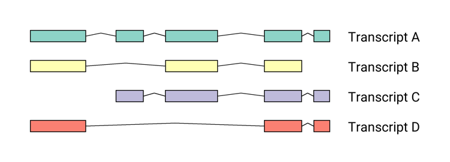
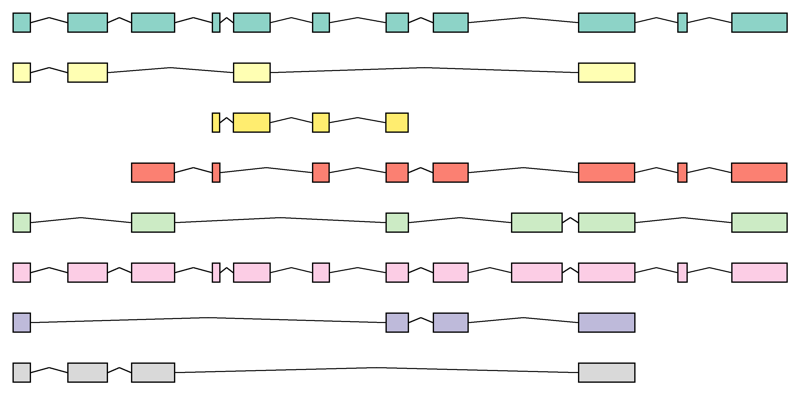

> [!IMPORTANT]
> **This repository has moved to Codeberg.**
>
> Active development now happens at **[https://codeberg.org/sandyjmacdonald/draw_exons](https://codeberg.org/sandyjmacdonald/draw_exons)**.
>
> This GitHub copy is archived and read-only. Please file issues, open pull requests, and follow the project on Codeberg.

---

# draw_exons

Small Python module for drawing exon structures of transcripts.

## Example images

Labelled CDS group:

CDS group:

Highlighted exon:

